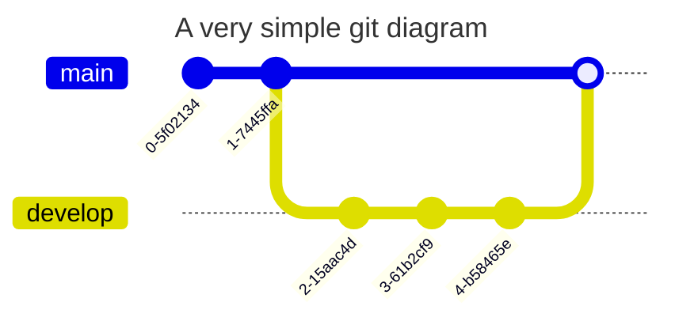

# data-ops

## What is this?

This is a collection of Data Ops snippets. It is connected to both Azure DevOps and Github so that concepts can be tested and shared in a more structured way.

## Mermaid test

This has been added to test Mermaid integration in Github and Azure DevOps and has no relevance to anything right now.

### GitGraph Test

### GitGraph Failed in Azure DevOps

Yeah so that didn't work and furthermore, gitGraph isn't supported by DevOps (boo) only the following:

- Flowchart
- Sequence diagrams
- Gantt charts
- Pie charts
- Requirement diagrams
- State diagrams
- User Journey

### Flowchart Test

So let's try a flowchart:

### Consolidated Flowchart Test

What is annoying is that they syntax is different for Azure DevOps WHY!?!? Is there a way to consolidate the two? Probably not but here's an attempt...

::: mermaid

:::